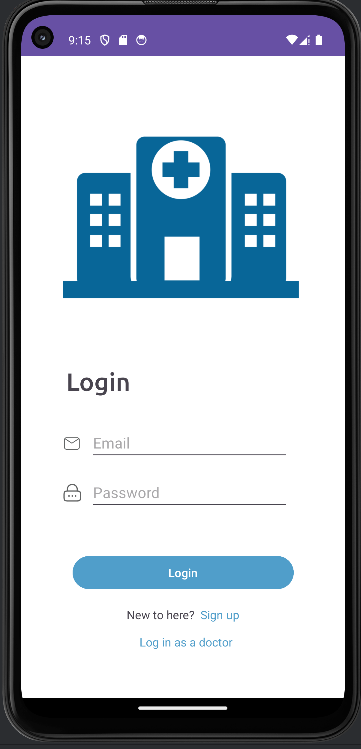
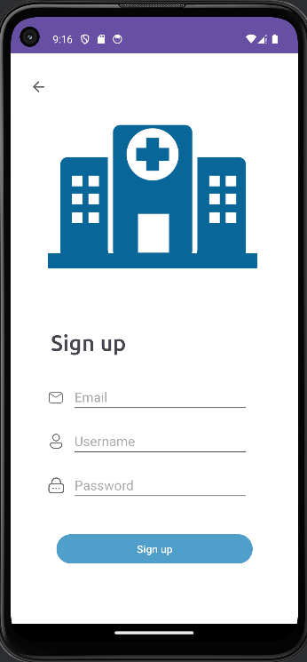
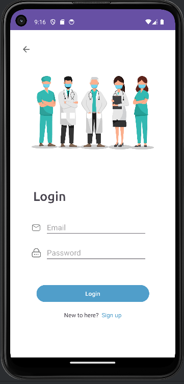
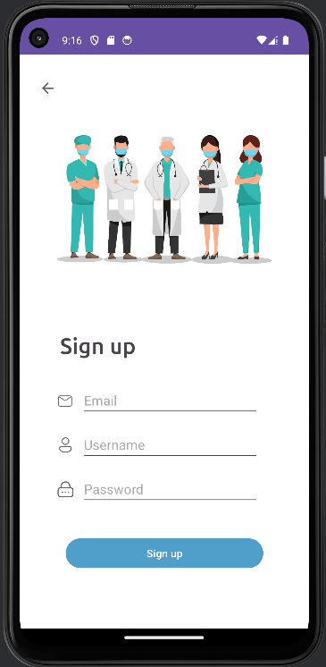
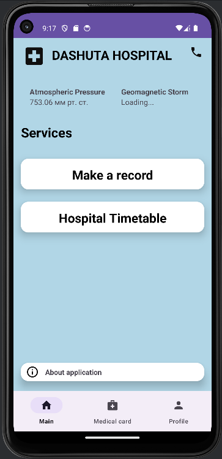
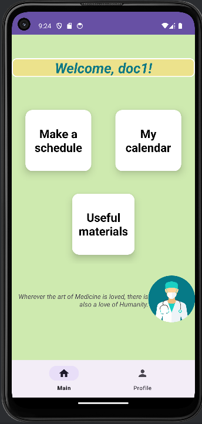
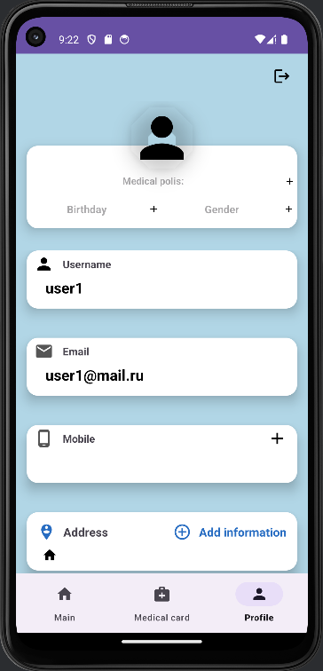
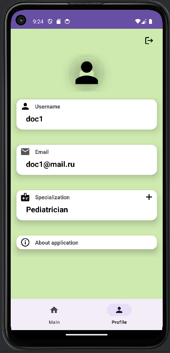

# 🏥 Приложение поликлиники

Приложение поликлиники на **Java** с использованием **Firebase console** для хранения данных, разработанное в **Android Studio**.
Данное приложение позволяет заходить под разными ролями (врач или пациент), добавлять необходимую информацию в профили, создавать записи, регулировать расписание и быстро находить необходимую информацию об организации.

---

## 📸 Скриншоты
Экран входа (пациент):

Экран регистрации (пациент): 

Экран входа (врач):

Экран регистрации (врач): 

Главный экран (пациент):

Главный экран (врач):

Профиль (пациент):

Профиль (врач):

---

## ✨ Основной функционал
- 👨🏼 Разделение на роли (врач и пациент)  
- 🖊️ Создание записи
- 💳 Заполнение данных 
- 📆 Формирование расписания 
- 💻 Просмотр медицинских статей  
- 📝 Просмотр созданных записей 

---

## 🛠 Технологии
- **Язык**: Java 
- **БД**: Firebase console  

---
